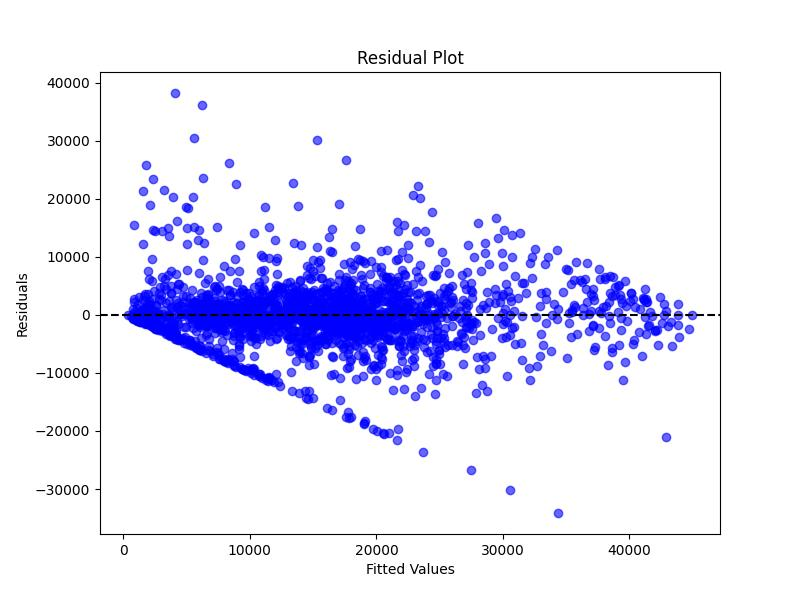

 <h1 align="center">Car-Price-Prediction</h1>

## Introduction
This repository contains a machine learning project focused on predicting car prices based on various features. The project involves data preprocessing, model training, evaluation, and visualization.

## Dataset
The dataset containing car-related features like "Model", "Manufacturer", "Category", "Fuel type", ... 

You can find this dataset at **car_price_pridiction.csv**

## Training
You can find at **train.py** and the trained model is at **trained model.pkl**

## Evaluation

### Metrics
|Metric|Value|
|-----------|:-----------:|
|R2 score|0.7256599936071768|
|Mean Absolute Error|3610.191721953441|
|Mean Squared Error|30753049.7240442|

### Residual Plot

### Testing
You can find at **test.py**.

## Requirements
* python
* pandas
* sklearn
* matplotlib
